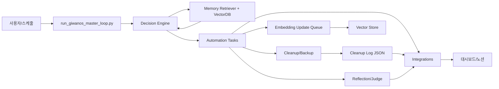

# 📄 VELOS(벨로스) 설계·운영 기준서 v6 (완전판)

## 1. 시스템 개요

**VELOS(벨로스)**는 GPT-5 기반 초고도화 AI 운영 자동화 시스템입니다.

### 주요 특징
1. **의사결정 엔진 일원화** — 모든 요청·작업을 중앙 Decision Engine에서 처리
2. **4계층 메모리 구조** — Working / Episodic / Semantic / Procedural
3. **다중 연동 자동화** — Slack / Notion / Email / Pushbullet / (향후 Jira·Trello·Sheets)
4. **풀 오토 루프** — 정리·백업·보고·전송이 하나의 루프로 완결

---

## 2. 아키텍처 개요

| Layer           | 주요 모듈                          | 기능 |
|-----------------|-----------------------------------|------|
| Core Decision   | context_aware_decision_engine.py  | 요청 분석 → 메모리/외부 데이터 기반 실행 |
|                 | adaptive_reasoning_agent.py       | 조건 변화 시 동적 판단 (Rule + LLM 혼합) |
| Memory          | HybridMemoryManager               | 4계층 기억 관리, 자동 태깅/정리/중복 제거 |
|                 | memory_cleaner.py                 | 중복·불필요 기록 삭제 |
|                 | reflection_risk_tagger.py         | 회고 위험도 태깅 |
| Automation      | report_and_disk_cleanup.py        | 오래된 파일 삭제 |
|                 | smart_backup_recovery.py          | 백업·복구 |
|                 | git_sync.py                       | 자동 커밋/푸시 |
| Integration     | Slack / Notion / Email / Pushbullet| 외부 서비스 연동 |
| Evaluation      | JudgeAgent                        | 실행 결과 평가 |
|                 | Reflection Agent                  | 주간 회고 생성 |
| Interface       | Streamlit 대시보드                | 상태·보고서·Memory Viewer·루프 제어 |

---

## 3. 임베딩 서브시스템

- **모델**: sentence-transformers/all-MiniLM-L6-v2
- **캐시**: C:/giwanos/vector_cache (Git 제외)

### 업데이트 파이프라인
1. 신규 파일 스캔
2. 청크링/태깅
3. 임베딩 생성
4. 캐시 등록
5. 인덱스 리빌드

### 검증 절차
- 인덱스 파일 크기 변화 확인
- 신규 데이터 검색 정확도 점검
- 캐시 무결성 테스트

---

## 4. 환경 변수 (.env)

| 변수                    | 설명               | 필수 |
|------------------------|--------------------|------|
| OPENAI_API_KEY         | OpenAI API Key     | ✅ |
| OPENAI_MODEL           | 모델명 (예: gpt-5) | ✅ |
| VELOS_NAMESPACE        | 시스템 네임스페이스 | ✅ |
| ROOM_BASE_ID           | 채팅방 기본 ID     | ⬜ |
| ROOM_ALLOW_SUBROOM     | 하위 방 허용 여부  | ⬜ |
| NOTION_TOKEN           | Notion API 토큰    | ✅ |
| NOTION_PAGE_ID         | 보고서 페이지 ID   | ✅ |
| NOTION_DATABASE_ID     | 데이터베이스 ID    | ⬜ |
| NOTION_LOG_DATABASE_ID | 로그용 DB ID       | ✅ |
| SLACK_BOT_TOKEN        | Slack Bot 토큰     | ✅ |
| SLACK_CHANNEL_ID       | Slack 채널 ID      | ✅ |
| EMAIL_*                | SMTP 이메일 계정정보 | ⬜ |
| PUSHBULLET_API_KEY     | Pushbullet API Key | ⬜ |
| HF_HOME                | HuggingFace 캐시 경로 | ✅ |
| TRANSFORMERS_CACHE     | Transformers 캐시 경로 | ✅ |

---

## 5. 데이터 플로우

---

## 6. 운영 시나리오

### 정상 루프
1. venv 활성화 및 환경변수 로드
2. 마스터 루프 실행 → 판단 → 작업 수행
3. 보고서·회고 생성 → Notion·Slack·Email·Pushbullet 전송

### 장애 처리
1. 로그(data/logs/) 분석
2. Auto Recovery Agent 실행
3. 재시도 실패 시 Slack/Email 경고
4. API Key 만료 시 자동 재발급 시도
5. 전송 실패 데이터 큐에 저장 후 재전송

### 백업 복구
1. data/backups/ 최신 ZIP 추출
2. 대상 디렉토리 교체
3. 복구 검증 스크립트 실행

---

## 7. 스케줄러

- **작업명**: VELOS_Cleanup_Upload  
- **스크립트**: scripts/cleanup_and_upload.ps1  
- **주기**: 매일 03:00  

---

## 8. 품질·안전 가이드

- .env 민감값 Git 제외 + 로컬 암호화
- GPT-5 파라미터 고정
- 로그 경고·재시도 로직 유지
- 세션 일관성 유지 (room_id 기반)
- 변경 전 자동 백업

---

## 9. 진행 현황

| 상태   | 작업 | 진행률 |
|--------|------|--------|
| 완료   | GPT-5 파라미터 정합성 수정 | 100% |
| 완료   | Notion 통합/CLI 구축 | 100% |
| 완료   | Cleanup+업로드 스케줄러 | 100% |
| 진행 중 | NOTION_LOG_DATABASE_ID 반영 | 80% |
| 진행 중 | Cleanup→Memory/Evaluation 연계 | 60% |
| 진행 중 | 대시보드 현황 표시 | 50% |
| 예정   | 주간 Re-index 자동화 | - |
| 예정   | Jira/Trello/Sheets 커넥터 | - |
| 예정   | 모바일·로컬 세션 동기화 | - |

---

## 10. 하루 스프린트 액션

1. .env에 NOTION_LOG_DATABASE_ID 추가 후 업로드 검증
2. Cleanup 결과를 HybridMemoryManager에 기록
3. JudgeAgent 영향도 분석 규칙 추가
4. 대시보드 메트릭 카드 구현

---

## 11. 변경 이력

- v1: 기본 구조·목표 정의
- v2: 아키텍처 세부화
- v3: 임베딩 서브시스템·런북·스케줄러 반영
- v4: 모듈 기능 표·임베딩 검증 절차 추가
- v5: .env 표·장애/복구 시나리오 추가
- v6: 예외 처리 확장·진행률·보안 정책·테스트 절차 보강
